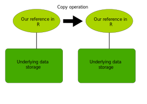

Version 1.0.0

Aims

-   Speed

-   Comparmentalisation and modularity

Topics

-   Loops

-   General issues with control structure speed in R

-   data.table

-   Classes

-   ~~R packages (sorry, this has been excluded due to time)~~

-   ~~Relational databases (sorry, this has been excluded due to time)~~

# Background

-   A small analysis usually grows into something larger and more
    complex.
-   The analysis is usually re-run more times than expected. Someone
    (you?) may want to re-run the analysis for reproducibility.
-   Large datasets.
-   We want our analyses to run quickly.
-   Combinations (interactions) of the above.

# 0. Preparations

0+5 min

## Activity + Q&A

-   Open the project in your IDE (RStudio).

-   (if you are all done) Edit the code in analysis script 1
    ([here](src/analysis-script-1-messy-and-slow-analysis-script.R)) and
    code chunks. Run this code. Look at the content of variables.

## General

If you are a new user of R and RStudio, **do not worry if you can't
finish all the preparation steps right now**. There will be time later
to catch up. Make an attempt at installing and getting the files into
the right place. If you can't finish, **please follow along the
presentation when it continues**, and you will have time to catch up in
the later breaks and practicals.

To run the code in the example files and examples in this document, you
will need to install and download a couple of resources.

## Setting up your programming environment

If you do not have R and an integrated development environment (IDE) to
develop R programs, you will need to install these first. Please follow
[this guide](https://rstudio-education.github.io/hopr/starting.html) to
install R and RStudio for your platform.

## Getting the workshop files from GitHub to your computer

The workshop is hosted on GitHub in [this
repository](https://github.com/johanzvrskovec/programming-workshop). You
can either clone this repository using Git, or download the content by
1.) clicking the large green button saying "\< \> Code", 2.) selecting
"Download ZIP", 3.) unpack the downloaded ZIP file. It should contain
the workshop project directory.

**Note: You will have to manually edit file path settings for some of
the code files to work on your computer!**

## R packages

You can install the required R packages by running this code.

```{r install required packages, eval=FALSE, purl=FALSE}

install.packages('tictoc')
install.packages('data.table')

```

## Data files

To run the example analysis scripts you will need two data files. Both
of these files are to be put into the project `data` folder.

### The reference panel file

One data file; `reference.1000G.maf.0.005.txt.gz`, contains a reference
list of genetic variants. Please download the variant reference file
from
[here](https://utexas.app.box.com/s/vkd36n197m8klbaio3yzoxsee6sxo11v).

### The Genome-Wide Association Study summary statistics file

The other data file; `GCST90027164_buildGRCh37.tsv.gz`, contains summary
statistics from a Genome-Wide Association Study (GWAS) performed on
Amyotrophic lateral sclerosis (ALS). This file can be downloaded from
[here](https://ftp.ebi.ac.uk/pub/databases/gwas/summary_statistics/GCST90027001-GCST90028000/GCST90027164/).

Do not forget to put the downloaded files into the project `data` folder
for the workshop scripts to work.

# 1. Baseline; an unstructured and slow analysis script

T+5 min\
5 min

We can imagine an unstructured and slow analysis script which will serve
as our starting point and reference. An example of such a script;
analysis script 1, can be seen
[here](src/analysis-script-1-messy-and-slow-analysis-script.R). This is
a pretend scenario with made-up analyses which we will improve
throughout the workshop. The script is supposed to illustrate an
analysis script which someone made to do *ad-hoc* computations.

Please have a look inside this script.

The example analysis is computing a Z score for a set of genetic
variants in the summary statistics from a Genome-Wide Association Study
(GWAS).

It:

1.  Reads compressed files with csv/tsv type data into two data-frames.

2.  Runs analysis steps for each specified genetic variant. These are
    specified by an id; rs-number in this case.

# 2. Basic control structures

T+10 min\
5 min

## Conditional statements

Conditional statements execute code based on a condition.

### Example: if

```{r examples conditional statements if}

var1 <- 1
var2 <- 2 - 1
var3 <- NA

if(var1 == var2){
  cat("We are in the conditional block!")
  var3 <- var1 + var2 + 1
}

var3

```

### Example: ifelse

```{r examples conditional statements ifelse}

var1 <- 1
var2 <- 2 - 1
var3 <- NA

var3 <- ifelse(var1==var2, var1 + var2 + 1, NA)

var3

```

## Loops

### Example: for

For-loop along a list

```{r examples conditional statements for}

lValuesToProcess <- c(1,2,3,4,5)
output <-c()

for(v in lValuesToProcess){
  output[length(output)+1]<-v+1
}

output

```

For-loop with an index

```{r examples conditional statements for 2}

lValuesToProcess <- c(1,2,3,4,5)
output <-c()

for(iV in 1:length(lValuesToProcess)){
  output[iV]<-lValuesToProcess[iV]+1
}

output

```

## Functions

Functions structure code that you want to execute repeatedly.

Example: function, with default value for an argument

```{r examples functions}

myFunction <- function(
    myArgument1=1,
    myArgument2
    ){
  myArgument1 + myArgument2
}

#test
myFunction(myArgument2 = 2)
myFunction(myArgument2 = 3)
myFunction(myArgument2 = 10)

```

## Conclusions

-   Use control structures to structure your program and make it more
    compartmentalised and re-usable.

-   You can make the program more effective both in terms of maintenance
    and readability, and in terms of resource use and execution speed.
    These aims may sometimes be mutually exclusive.

## Further material on control structures

Conditional control structures and loops

<https://www.w3schools.com/r/r_if_else.asp>

<https://www.w3schools.com/r/r_while_loop.asp>

# 3. Variable scope in control structures

T+15 min\
5 + 10 min

When using control structures, you need to be aware of the scope
variables are in. Scope concerns:

1.  whether a variable is available inside a control structure or not

2.  how setting a variable is reflected outside of the control structure

Control structures such as if and for share scope with the outside
environment. This was demonstrated in previous examples.

Functions (and classes - see later content) do not share the scope of
the outside environment in the same way. Functions can read external
variables, but typically not set them in the outside scope.

### Example: scope in functions

```{r examples scope functions}

var1 <- 1
var2 <- 2
var3 <- NA

myFunction <- function(
    myArgument1=1,
    myArgument2
    ){

  var3 <- var1 + myArgument2
  var3
}

#test
myFunction(myArgument2 = 2)
var3


```

## Activity + Q&A

-   Test the scope of a function in the above examples
-   Try running the second analysis script. The second analysis script
    continues on the pretend analysis scenario from the first script and
    has been enhanced with basic loop control structures. You can find
    it
    [here](src/analysis-script-2-less-messy-but-slow-analysis-script.R).
    It:
    1.  Reads compressed files with csv/tsv type data into two
        data-frames.

    2.  Runs analysis steps for each specified genetic variant. The
        specified genetic variants are held in the `lSelectedVariants`
        list, which now is randomly generated as a subset of the GWAS
        dataset.

# 4. Data linking and joins

T+30 min\
5+10 min

A large part of our current pretend analysis consists of linking one
dataset (the reference list) with the other datsaet (the GWAS dataset).
There are optimised routines to do this called 'joins'. There are
different types of joins based on what data is preserved when matching
rows from either dataset.

## Inner join

In an 'inner join', the rows of two datasets are matched on a condition.
All matches are saved, allowing for duplicate matches, and all
non-matching rows are excluded.

### Example: inner join

This is an inner join performed in standard R.

```{r examples joins inner-join}

df1 <- data.frame(
  id=c(1,2,3,4,5),
  value=c("apple",47,"banana",-123.7,99)
)

df2 <- data.frame(
  id=c(1,3,4,3,6),
  value=c(1986,1965,2007,1981,1999)
)

dfInnerJoin<-merge(df1,df2,by = "id", all = FALSE)
dfInnerJoin


```

## Left (outer) join

In a 'left join', the rows of two datasets are matched on a condition.
All matches are saved, allowing for duplicate matches, all non-matching
rows of the first (left) dataset are saved but the non-matching rows of
the second (right) dataset are excluded.

### Example: left (outer) join

This is a left join performed in standard R.

```{r examples joins left-join}

df1 <- data.frame(
  id=c(1,2,3,4,5),
  value=c("apple",47,"banana",-123.7,99)
)

df2 <- data.frame(
  id=c(1,3,4,3,6),
  value=c(1986,1965,2007,1986,1999)
)

dfLeftJoin<-merge(df1,df2,by = "id", all.x = TRUE, all.y = FALSE)
dfLeftJoin


```

## Right (outer) join

In a 'right join', the rows of two datasets are matched on a condition.
All matches are saved, allowing for duplicate matches, all non-matching
rows of the second (right) dataset are saved but the non-matching rows
of the first (left) dataset are excluded.

### Example: right (outer) join

This is a right join performed in standard R.

```{r examples joins right-join}

df1 <- data.frame(
  id=c(1,2,3,4,5),
  value=c("apple",47,"banana",-123.7,99)
)

df2 <- data.frame(
  id=c(1,3,4,3,6),
  value=c(1986,1965,2007,1981,1999)
)

dfRightJoin<-merge(df1,df2,by = "id", all.x = FALSE, all.y = TRUE)
dfRightJoin
```

## Full outer join

In a 'full outer join', the rows of two datasets are matched on a
condition. All matches are saved, allowing for duplicate matches, all
non-matching rows of either dataset are saved.

### Example: full outer join

This is a full outer join performed in standard R.

```{r examples joins full-outer-join}


df1 <- data.frame(
  id=c(1,2,3,4,5),
  value=c("apple",47,"banana",-123.7,99)
)

df2 <- data.frame(
  id=c(1,3,4,3,6),
  value=c(1986,1965,2007,1981,1999)
)

dfFullOuterJoin<-merge(df1,df2,by = "id", all.x = TRUE, all.y = TRUE)
dfFullOuterJoin
```

## Activity + Q&A

-   Run the different joins above.
-   Run the third analysis script and inspect the output. The third
    analysis script continues on the pretend analysis scenario from the
    first and second scripts and has been changed to use an inner join
    instead of the value matching in the previous loop. You can find it
    [here](src/analysis-script-3-using-joins.R). It:
    1.  Reads compressed files with csv/tsv type data into two
        data-frames.

    2.  Runs analysis steps for each specified genetic variant. The
        specified genetic variants are specified by the `selected`
        column in the GWAS data frame, rather than in a separate list.

    3.  The output is based on the resulting data frame from the inner
        join procedure.

# 5. Introduction to the package data.table

T+45 min\
5+10 min

## Background

The package data.table is primarily an alternative form of a data.frame.
The package also contains utilities to work with this alternative data
format. We consider it here because it has some specific advantages in
terms of speed, utility, and syntax.

## Creating a data.table

You can create a data.table from scratch, or convert a data.frame into a
data.table.

### Example: creating a data.table

This demonstrates how to create a data.table from scratch or converting
between a data.frame and a data.table.

```{r examples data.table creation}

library(data.table)

#a new data.table
dt1 <- data.table(
  id=c(1,2,3,4,5),
  value=c("apple",47,"banana",-123.7,99)
)
dt1

#a data.frame
df2 <- data.frame(
  id=c(1,3,4,3,6),
  value=c(1986,1965,2007,1981,1999)
)

#convert a data frame into a data table
dt2<-as.data.table(df2)
dt2

#or you can set a data.frame to aquire data.table character (faster?)
dt2<-df2
setDT(dt2)
dt2

```

## Element access and subsets in data.table

Rather than providing full lists in an element access query, you can
reference the internal data.table columns.

### Example: referencing internal data.table columns

```{r}

#example of subselection in data.frame
df1 <- data.frame(
  id=c(1,2,3,4,5),
  value=c("apple",47,"banana",-123.7,99)
)
df1[df1$value=="apple" | df1$value == '99', c("id","value")]

library(data.table)

#example of subselection in data.table
dt1 <- data.table(
  id=c(1,2,3,4,5),
  value=c("apple",47,"banana",-123.7,99)
)

dt1[value=="apple" | value == '99', ]
dt1[value=="apple" | value == '99', .(id)] #column subset
dt1[value=="apple" | value == '99', .(id, number=value)] #direct rename


```

Subsets from a data.table will always be returned as a data.table. This
is different from data.frame where single column selections would be
converted into lists. In data.table you will get single column/row
selections as a single columned/rowed data.table.

### Example: single column subset

```{r}

#example of subselection in data.frame
df1 <- data.frame(
  id=c(1,2,3,4,5),
  value=c("apple",47,"banana",-123.7,99)
)
df1[df1$id==2 | df1$id==3, c("value")] #column subset
df1[df1$id==2, ] #row subset

library(data.table)

#example of subselection in data.table
dt1 <- data.table(
  id=c(1,2,3,4,5),
  value=c("apple",47,"banana",-123.7,99)
)

dt1[id==2 | id == 3, .(value)] #column subset
dt1[id==2, ] #row subset


```

## Activity + Q&A

-   Run the data.table examples above

# Longer break

T+60 min\
0+15 min

Here we have a longer break. This should be a real break and not a
practical activity. Feel free to review the previous content and
experiment with running the examples and scripts. You can also try to
solve any technical issues you may have encountered; for example if you
gave not yet managed to make your IDE working or gotten hold of the
material.

# 6. Differences in memory models, and data.table joins

T+75 min\
5+10 min

## The memory model of data.table

The default behaviour of R and data.frame is to use a *deep copy* of
data during various operations and specifically when traversing function
scopes. This requires considerable resources and time to perform
(proportional to the size of the data).

In data.table however, we use a *shallow copy* of the data on the R end
(or direct memory reference) as default, referring to the same
underlying data across scopes such as functions and join operations.

See the below schematic illustrations of a deep and shallow memory
operation.




### Example: function scope when using data table

A data.frame is deep copied into the function, and the operation inside
the function will only affect the function copy. The data.table is
passed to the function with a reference to the underlying data in a
shallow copy, and the operation inside the function will persist outside
of the function.

```{r}

library(data.table)

df1 <- data.frame(
  id=c(1,2,3,4,5),
  value=c("apple",47,"banana",-123.7,99)
)

dt1 <- data.table(
  id=c(1,2,3,4,5),
  value=c("apple",47,"banana",-123.7,99)
)

myFunction <- function(
    myArgument1,
    myArgument2
    ){
  
  df1Inside<-myArgument1
  dt1Inside<-myArgument2
  print(df1Inside)
  print(dt1Inside)

  
  df1Inside[df1Inside$id==1,c("value")]<-"banana2"
  dt1Inside[id==1,value:="banana2"]
  
}

#test
myFunction(df1,dt1)

df1
dt1


```

## Join using data.table

You can join data.tables in the same way as you could join data.frames,
using the the merge function. Additionally, the package data.table
provides data sorting and indexing options, making join operations on
data.tables more efficient and faster.

### Example: data.table join using merge and index

```{r}

library(data.table)

dt1 <- data.table(
  id=c(1,2,3,4,5),
  value=c("apple",47,"banana",-123.7,99)
)
setkeyv(dt1,cols = "id")

dt2 <- data.table(
  id=c(1,3,4,3,6),
  value=c(1986,1965,2007,1981,1999)
)
setkeyv(dt2,cols = "id")

dtFullOuterJoin<-merge(dt1, dt2, by = "id", all=TRUE)
dtFullOuterJoin

```

## Alternative data.table join syntax

The package data.table also comes with its own, more powerful, join
syntax based on the previous subset/element access syntax.

### Example: data.table join using the data.table syntax

```{r}

library(data.table)

dt1 <- data.table(
  id=c(1,2,3,4,5),
  category=c('a','a','b','a','b'),
  year=c(1986,1965,2007,1981,1999)
)
setkeyv(dt1,cols = c("id","category"))

dt2 <- data.table(
  id=c(1,3,4,3,6),
  categoryOtherName=c('a','a','b','b','b'),
  year=c(1976,1965,2007,1981,1999)
)
setkeyv(dt2,cols = c("id","categoryOtherName"))

#right join
dtRightJoin<-dt1[dt2, on=c("id", category="categoryOtherName"), ]
dtRightJoin

#left join
dtLeftJoin<-dt2[dt1, on=c("id", categoryOtherName="category"), ]
dtLeftJoin

#inner join
dtInnerJoin<-dt1[dt2, on=c("id", category="categoryOtherName"), nomatch = NULL]
dtInnerJoin

#inner join with other condition than equality
#note how the output from the 'right' dataframe is preferred
dtInnerJoinCondition<-dt1[dt2, on=list(id, year>=year), nomatch = NULL]
dtInnerJoinCondition

```

### Example: data.table join updating a data.table by reference

It is possible to update a data in-place during a join operation, rather
than copying and creating a new data.table. This operation is very fast.

```{r}

library(data.table)

dt1 <- data.table(
  id=c(1,2,3,4,5),
  category=c('a','a','b','a','b'),
  year=c(1986,1965,2007,1981,1999)
)
setkeyv(dt1,cols = c("id","category"))

dt2 <- data.table(
  id=c(1,3,4,3,6),
  categoryOtherName=c('a','a','b','b','b'),
  year=c(1976,1965,2007,1981,1999)
)
setkeyv(dt2,cols = c("id","categoryOtherName"))


#join, updating dt1 by reference
dt1[dt2, on=list(id, year>=year), c('otherYear','newColumn') := list(i.year,'pineapple')]
dt1
```

## Activity + Q&A

-   Run the data.table examples above
-   Explore and run the fourth analysis script
    [here](src/analysis-script-4-using-data-table.R).

# 9. Classes in R, and specifically Reference Classes

T+90 min\
5 + 10 min

Classes are extensions to function arguments and scopes where multiple
functions can share the same context.

## The R Reference Class

R has many types of classes. We will focus on the class called Reference
Class due to its preferable memory handling properties.

### Example: Reference Class

```{r}

myAnalysisClassHandle <- setRefClass(
  "myAnalysisClass",
   fields = list(
   myChar = "character",
   myNum = "numeric",
   myDF = "ANY"
   ),
   methods = list
   (
     #this is the constructor as per convention
     initialize=function(myCharInit)
     {
       myChar <<- myCharInit
       myNum <<- 2
       myDF <<- data.frame(
                  id=c(1,2,3,4,5),
                  value=c("apple",47,"banana",-123.7,99)
                )
       
       myDF$myNumInObj <<- rep(myNum,nrow(myDF))
     }
  )
)

# we can add more methods after creating the ref class (but not more fields!)
myAnalysisClassHandle$methods(
  doSomething=function(myNumSet){
    
    myNum <<- myNumSet
    myDF$newColumn <<- rep(myNum,nrow(myDF))
    
    return(myNum)
   
  }
)

#analysisObj$anotherField<-"test" #no, this does not work

analysisObj <- myAnalysisClassHandle(myCharInit = "hello!")
#analysisObj <- new("myAnalysisClass", myCharInit = "hello!") #alternatively 
analysisObj$myObj
analysisObj$doSomething(myNumSet = 99)
analysisObj$myObj

```

## Activity + Q&A

-   Run the example above.
-   Try to add more member fields and functions/methods to your class.
    Run your new methods.

# 10. Row-wise operations in a loop, revisited

T+105 min\
5+10 min

Sometimes you just want (or need) to have a loop. How can we make it not
be slow?

### Example: fast row-wise operations in data.table

```{r}

library(data.table)

dt1 <- data.table(
  id=c(1,2,3,4,5),
  category=c('a','a','b','a','b'),
  year=c(1986,1965,2007,1981,1999)
)
setkeyv(dt1,cols = c("id","category"))

setorder(dt1, year,-id) #this orders the data.table

someValue<-4

for(iDt1 in 1L:nrow(dt1)){
  set(x = dt1, i = iDt1, j = "newColumn", value = iDt1+eval(someValue))
}

dt1


```

### Example: fast row-wise operations in a Reference Class

```{r}

myAnalysisClassHandle <- setRefClass(
  "myAnalysisClass",
   fields = list(
   myChar = "character",
   myNum = "numeric",
   myDF = "ANY"
   ),
   methods = list
   (
     #this is the constructor as per convention
     initialize=function(myCharInit)
     {
       myChar <<- myCharInit
       myNum <<- 2
       myDF <<- data.frame(
                  id=c(1,2,3,4,5),
                  category=c('a','a','b','a','b'),
                  year=c(1986,1965,2007,1981,1999)
                )
     }
  )
)

# perform the row-wise operation
myAnalysisClassHandle$methods(
  doSomething=function(index,newValue){
    
    myDF[index,c("newColumn")] <<- newValue
   
  }
)


someValue<-4
analysisObj <- myAnalysisClassHandle(myCharInit = "hello!")

for(iDf in 1:nrow(analysisObj$myDF)){
  analysisObj$doSomething(iDf, iDf+someValue)
}

analysisObj$myDF


```

## Activity + Q&A

-   Run the examples above
-   Explore and run the fifth analysis script
    [here](src/analysis-script-5-loops-revisited.R).
